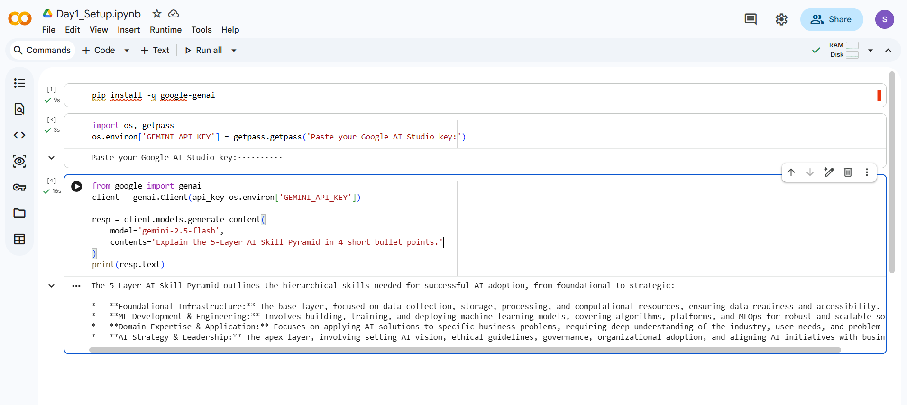
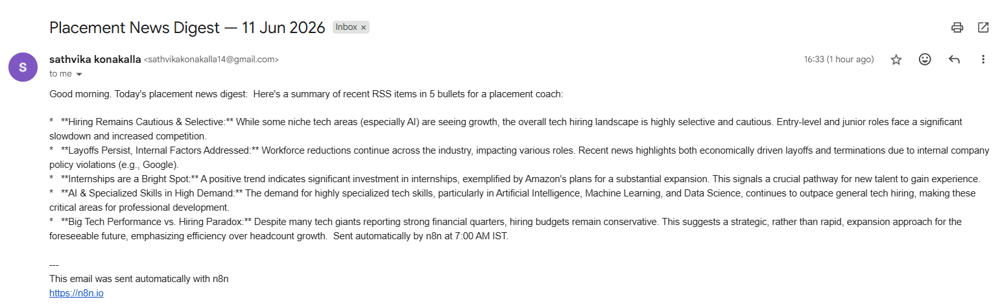

# AI Mentor Bootcamp — Konakalla Chopra Lakshmi Sathvika

Public portfolio of 12-day AI Trainer Workshop. By Day 12: 6 daily notebooks + capstone Streamlit URL.

## Day 1 — Setup complete

* ✅ Google AI Studio API key provisioned
* ✅ Groq API key provisioned
* ✅ Hello-Gemini call working — see [Day1_Setup.ipynb](Day1_Setup.ipynb)
* 4-tool comparison matrix from Lab 1A: see screenshot below



## Day 2 Lab 2B — Errors handled

1. **Markdown fence wrapping**
   (` ```json ... ``` `)

   The retry prompt asks Gemini to output raw JSON without fences. Triggers on ~5–10% of calls.

2. **Hallucinated phone number when source has none**

   `Optional[str] = None` in Pydantic — model returns `null`, schema validates.

3. **Empty / whitespace-only input**

   Pydantic raises ValidationError with "Field required". Caller catches.

## Sample résumés processed: 3 / 3 successful

## Day 4 — Productivity sprint

**Company:** Accenture

**Time:** 45 minutes (timeboxed)

### Edit notes (3 lines)

1. Gamma confabulated a "hiring 50,000 freshers in 2025" stat on slide 6. Source said 40,000. Edited.
2. Slide 4 listed "Kubernetes" as a required skill — actually nice-to-have per the JD. Edited.
3. Slide 1 (cover) — replaced Gamma's generic "Your Career Awaits" with a company-specific line.

## Day 4 — n8n Daily News Digest

* ✅ Self-hosted n8n via Docker
* ✅ Workflow: Schedule (7AM IST) → RSS → Gemini summariser → Gmail
* ✅ Workflow JSON committed: [Day4_NewsDigest.json](Day4_NewsDigest.json)
* ✅ Test email screenshot below


